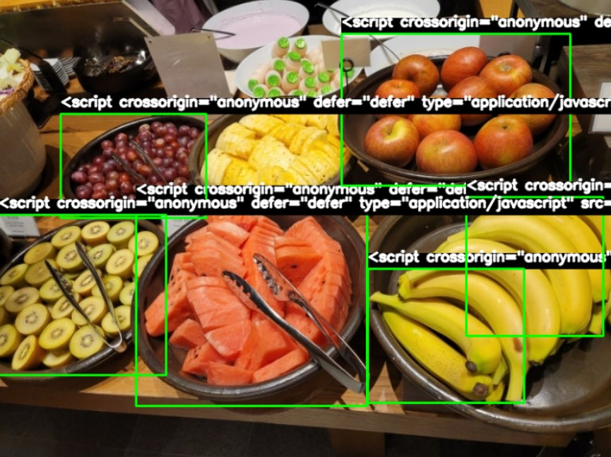

# Food-Inventory-Management-System
  실시간 음식 재고 관리 시스템

---

## 개요

**목표**: 이 시스템은 레스토랑, 카페, 식품 매장에서 남은 재고를 실시간으로 관리하고, 재고 부족 시 자동으로 주문을 처리해주는 시스템입니다. 이를 통해 주방 내 식재료 낭비를 줄이고, 효율적인 재고 관리가 가능해집니다.

**타겟 고객**: 레스토랑, 카페, 식료품 매장 등 식음료 업계 종사자

---

## 주요 기능

### 1. **객체 인식을 통한 실시간 음식 재고 추적**
- 시스템은 카메라 또는 센서를 통해 음식 이미지를 실시간으로 인식하여 재고 상태를 추적합니다.
- 각 재고는 이미지와 일치하는 바코드를 인식해 데이터베이스에 연동됩니다.

### 2. **자동 주문 시스템**
- 재고가 부족해지면 시스템이 자동으로 알림을 전송하거나 주문을 생성하여 재고를 보충할 수 있습니다.
- 실시간 모니터링을 통해 빠르게 반응할 수 있습니다.

### 3. **AI 기반 예측 시스템**
- AI는 예측된 소비량을 기반으로 재고를 자동으로 조정하여 불필요한 낭비를 방지합니다.
- 예측된 데이터에 맞춰 재고를 관리하여 효율성을 높입니다.

### 4. **바코드 인식을 통한 재고 추적**
- 음식 이미지와 일치하는 바코드를 스캔하여 정확한 재고 데이터를 추적합니다.

### 5. **데이터 관리 및 알림**
- 데이터베이스에 음식 이미지와 바코드 데이터를 저장 및 관리하여 효율적인 재고 추적이 가능합니다.
- 알림 시스템을 통해 재고 부족, 소비량 예측 결과 등을 실시간으로 사용자에게 전달합니다.

---

## 의미

- **음식 낭비 줄이기**: 재고 부족을 사전에 방지하고, 남은 재고를 효율적으로 관리하여 음식 낭비를 줄입니다.
- **운영 비용 절감**: 예측 시스템과 자동 주문 기능을 통해 재고 관리 비용을 절감합니다.
- **고객 경험 향상**: 재고 부족 문제를 예방하여, 고객에게 원활한 서비스를 제공할 수 있습니다.

---

## 기술 스택

- **객체 인식**: YOLO, OpenCV
- **AI 기반 예측**: TensorFlow, PyTorch
- **바코드 인식**: 바코드 스캐너 또는 카메라로 실시간 바코드 인식
- **자동 알림 시스템**: 푸시 알림 등을 통한 자동화된 알림 기능
- **프로그래밍 언어**: Python
- **데이터베이스**: MySQL, PostgreSQL 등

---

## 사용 방법

1. **필수 라이브러리 설치**
   
   프로젝트를 실행하기 전에 필요한 라이브러리를 설치해야 합니다.

   ```bash
   pip install opencv-python opencv-python-headless numpy tensorflow
   
2. **모델 다운로드 및 설정**

   YOLOv4 모델 파일 및 coco.names 파일을 다운로드하고 프로젝트 디렉토리에 저장합니다.

3. **프로젝트 실행**

    ```bash
    python main.py

4. **예시 입력 및 출력**

    ```bash
    입력: 음식 재고 이미지
    
    출력: 인식된 객체 목록 (예: 사과, 바나나)
          각 객체의 수량
          재고가 부족한 항목에 대한 경고

---

## 시연 이미지

